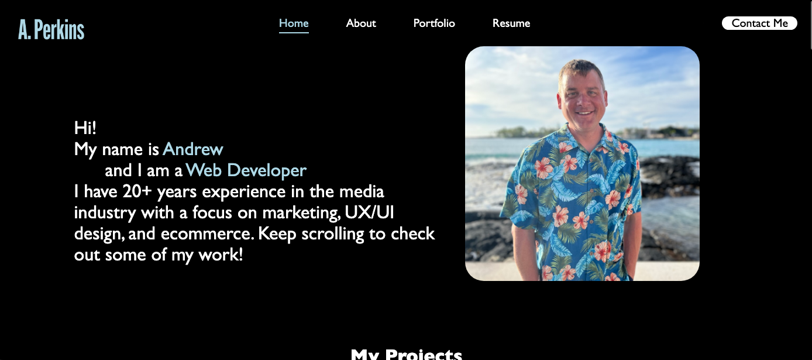

# APReactPortfolio

Greetings! This application showcases my projects portfolio built with React. The purpose of this app is to display the skills I have learned as a full stack web developer to prospective employers.

## User expectations

Following are details on what a user can expect to view on this single-page app:

* The user is presented with a page containing a header, a section for content, and a footer.
* At the top of the application the user will find my name and navigation corresponding to the app's various sections.
* When a user clicks on a navigation title they are presented with the corresponding section on the page.
* When a user loads the portfolio for the first time they are presented with the 'About' section by default.
* When a user is presented with the portfolio section they are presented with six of my applications with links to the deployed apps and GitHub repositories.
* When a user is presented with the contact section they are presented with a contact form with fields for name, email address, and a message.
* When a user clicks in and out of any of the contact fields without entering content they are presented with a message that the field is required.
* If a user does not enter a valid email address they are presented with a notification that they have entered an invalid email address.
* When a user is presented with the resume section they are presented with my resume and a link to download it.
* When a user is presented with the footer they find text with links to my GitHub, LinkedIn, and Facebook profiles.

## Technology

As previously mentioned, the portfolio is built using the React library with separate components for the various elements of the page. Components for this application include about, contact, footer, navbar, projects, and resume.

## Screenshot

## Link to Deployed Application

[Here is a link to the deployed application!](https://main--andrew-perkins-portfolio.netlify.app/)